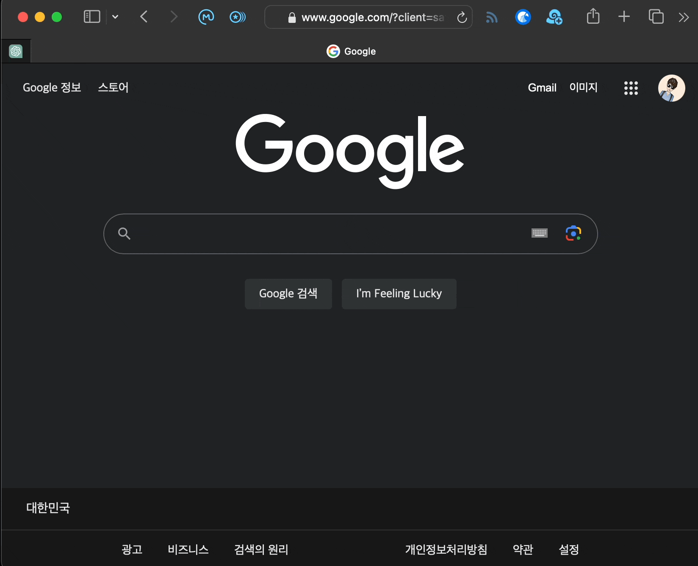
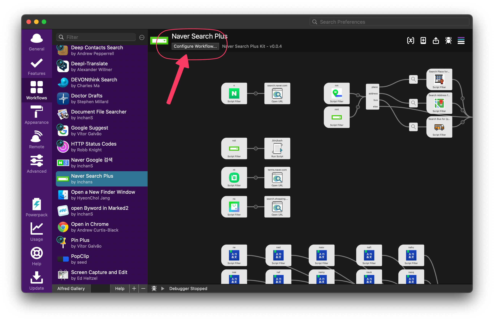
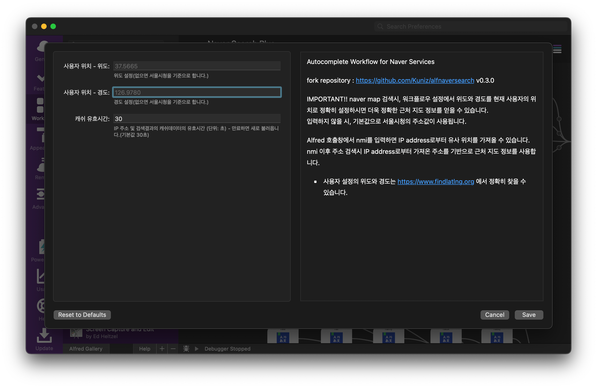

AlfNaverSearchPlus : Naver Search Workflow for Alfred  
==============

Naver Search Workflow for Alfred
---------------------------------

Alfred에서 네이버 검색, 네이버 쇼핑, 네이버 지식백과, 네이버 지도, 네이버 증권    
그리고 각종 네이버 사전 검색이 자동완성 되는 워크플로우
   
   
### **Acknowledgments**
[@Kuniz](https://github.com/Kuniz)님의 [alfnaversearch 워크플로우](https://github.com/Kuniz/alfnaversearch)를 따로이 개인적인 용도에 맞게 부분적으로 수정 및 개선한 워크플로우입니다.  
**alfnaversearch** 워크플로우의 코드기여는 [forked repository](https://github.com/inchanS/alfnaversearch)에서 진행하였습니다.    

변경부분
- 일부 script 호출 keyword 변경 
- 네이버 **지도 검색 기능 추가 및 개선** (updated v0.0.2)
  - 사용자 위치 설정 및 장소, 주소, 버스 전용보기 추가 
- 네이버 **주식 검색 추가** (updated v0.0.4)
   

Preview
--------
**네이버 검색, 쇼핑, 지식백과, 증권 등**  

   

**네이버 지도 검색**  

   

Configure Workflow...에서 사용자의 위치를 정확하게 입력후 `nm...`를 사용하시면,  
**IP 위치 기반(`nmi...`)보다 훨씬 더 자세한 근처 정보를** 얻을 수 있습니다!!   

   

Install workflow
--------------

- [releases](../../releases/latest) 페이지의 `NaverSearch.alfredworkflow`를 다운로드 받아서 실행한다.

- MacOS 12.3 이상의 경우
  - python3 설치
    - `brew install python`
    - `xcode-select --install`

- Alfred 4.0 이상 지원
- Python 2 사용 불가

General Usage
--------------
* `na ...`  : Naver Search(일반 네이버 검색)
* `ns ...`  : Naver Shopping(네이버 쇼핑 검색) - 네이버 가격비교 검색
  * `ns ...` + `shift`키 : 네이버플러스 스토어 검색 (updated v0.2.0) 
* `nt ...`  : Naver Terms(네이버 지식백과 검색)
* `nm ...` : Naver Map(네이버 지도 검색) - Configure 위치 설정값 기반 - **New**
* `nmi ...` : Naver Map(네이버 지도 검색) - IP 위치 기반 - **New**
* `nst ...` : Naver Finance - 증권 검색 - **New**

Dictionary Usage
--------------
* `nk ...` : Naver Korean Dictionary (국어 사전)
* `ne ...` : Naver Korean-English Dictionary (영어 사전)
* `nee ...` : Naver English-English Dictionary (영영 사전)
* `naj ...` : Naver Korean-Japanese Dictionary (일본어 사전)
* `nac ...` : Naver Korean-Chinese Dictionary (중국어 사전)
* `nah ...` : Naver Hanja Dictionary (한자 사전)
* `nad ...` : Naver Korean-German Dictionary (독일어 사전)
* `naf ...` : Naver Korean-French Dictionary (프랑스어 사전)
* `nai ...` : Naver Korean-Italian Dictionary (이탈리아어 사전)
* `nar ...` : Naver Korean-Russian Dictionary (러시아어 사전)
* `nas ...` : Naver Korean-Spanish Dictionary (스페인어 사전)
* `nat ...` : Naver Korean-Thai Dictionary (태국어 사전)
* `nav ...` : Naver Korean-Vietnamese Dictionary (베트남어 사전)
* `nan ...` : Naver Korean-Indonesian Dictionary (인도네시아어 사전)
* `nau ...` : Naver Korean-Uzbekistan Dictionary (우즈베키스탄어 사전)
* `nne ...` : Naver Korean-Nepali Dictionary (네팔어 사전)
* `namn ...` : Naver Korean-Mongolian Dictionary (몽골어 사전)
* `namy ...` : Naver Korean-Burmese Dictionary (미안마어 사전)
* `nasw ...` : Naver Korean-Swahili Dictionary (스와힐리어 사전)
* `naar ...` : Naver Korean-Aramaic Dictionary (아랍어 사전)
* `nacm ...` : Naver Korean-Cambodian Dictionary (캄보디아어 사전)
* `nafa ...` : Naver Korean-Persian Dictionary (페르시아어 사전)
* `nahi ...` : Naver Korean-Hindi Dictionary (힌디어 사전)
* `nanl ...` : Naver Korean-Dutch Dictionary (네덜란드어 사전)
* `nasv ...` : Naver Korean-Swedish Dictionary (스웨덴어 사전)
* `nauk ...` : Naver Korean-Ukrainian Dictionary (우크라이나어 사전)
* `naka ...` : Naver Korean-Gruziya Dictionary (조지아어 사전)
* `nacs ...` : Naver Korean-Czech Dictionary (체코어 사전)
* `nahr ...` : Naver Korean-Croatian Dictionary (크로아티아어 사전)
* `natr ...` : Naver Korean-Turkish Dictionary (터키어 사전)
* `napt ...` : Naver Korean-Portuguese Dictionary (포르투갈어 사전)
* `napl ...` : Naver Korean-Polish Dictionary (폴란드어 사전)
* `nafi ...` : Naver Korean-Finnish Dictionary (핀란드어 사전)
* `nahu ...` : Naver Korean-Hungarian Dictionary (헝가리어 사전)
* `nasq ...` : Naver Korean-Albanian Dictionary (알바니아어 사전)
* `naro ...` : Naver Korean-Rumanian Dictionary (루마니아어 사전)
* `nala ...` : Naver Korean-Latin Dictionary (라틴어 사전)
* `nael ...` : Naver Korean-Greek Dictionary (그리스어 사전)

### 단축키 관련 기능 추가
* **Cmd + C** : 상세 내용이 클립보드에 복사
* **Cmd + N, C** 혹은 **Cmd + Enter** : 자동완성 텍스트가 클립보드로 복사
* **Cmd + Y** 혹은 **Shift** : 검색결과 미리 보기 웹브라우져 출력

### Configure Workflow 추가

  

- **위도 및 경도** : `nm...` 네이버 지도검색시 사용자의 정확한 위치값 입력
  - 미입력시 기본값은 서울시청
  - https://www.findlatlng.org 에서 위치값을 정확히 찾을 수 있습니다. 
  - (추후 Alfred workflow 내에서 자동화 추가예정)
- **IP 주소 캐쉬 유효시간** : `nmi...` 네이버 지도검색시 사용되는 IP 주소의 캐쉬 저장 시간(단위: 초)으로 해당 시간 이후 키워드 재호출시 새로운 값을 불러옵니다. 
- **자동완성 검색어 캐쉬 유효시간** : `nm...`, `nmi...` 호출을 연이어 할 때, 이전 위치 기반의 검색어 결과가 캐쉬로 남아 이후 키워드 호출시 영향을 미침으로 추가
  - 미입력시 기본값은 5초   

Externel Module
--------------
 This workflow used alfred-workflow more than v0.0.2. Alfred-workflow can find there(https://github.com/deanishe/alfred-workflow).
 This workflow used alp(A Python Module for Alfred Workflows) module at v0.0.1. It created by Daniel Shannon. 
 Certifi : using ssl with default urllib

LICENSE
--------------
 - MIT
