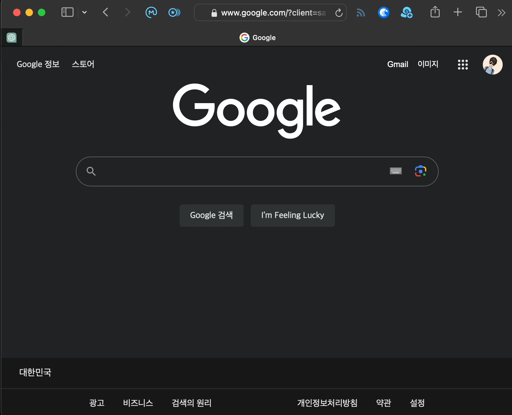
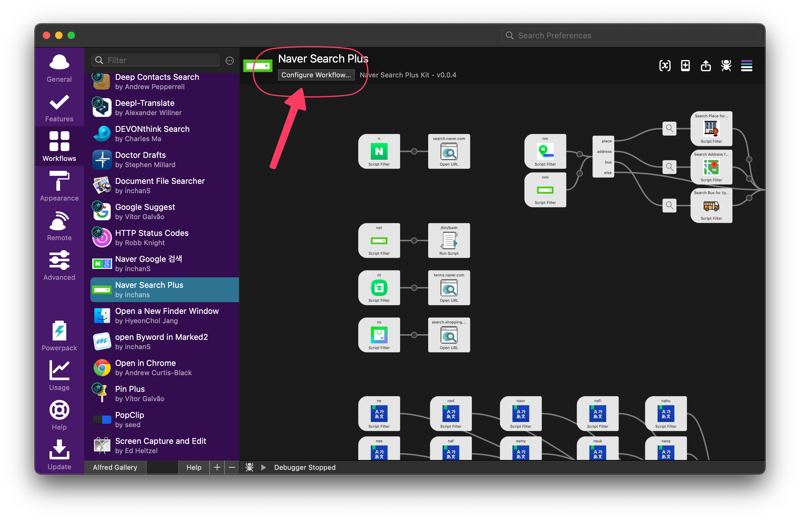
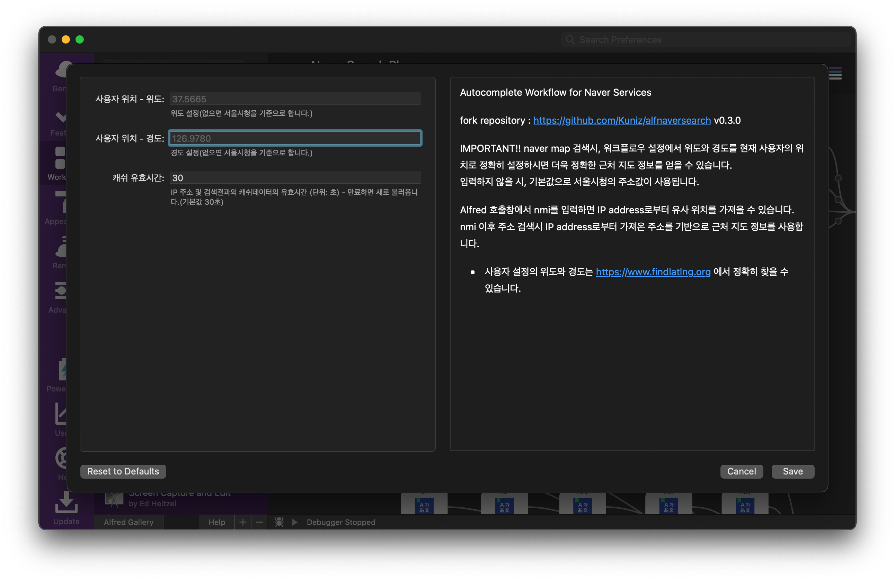

# AlfNaverSearchPlus : Naver Search Workflow for Alfred  
   

   

Naver Search Workflow for Alfred
---------------------------------

Alfred에서 네이버 검색, 네이버 쇼핑, 네이버 지식백과, 네이버 지도, 네이버 증권    
그리고 각종 네이버 사전 검색이 자동완성 되는 워크플로우
<br>  
<br>  
### **Acknowledgments**
[@Kuniz](https://github.com/Kuniz)님의 [alfnaversearch 워크플로우](https://github.com/Kuniz/alfnaversearch)를 따로이 개인적인 용도에 맞게 부분적으로 수정 및 개선한 워크플로우입니다.  
**alfnaversearch** 워크플로우의 코드기여는 [forked repository](https://github.com/inchanS/alfnaversearch)에서 진행하였습니다.    

변경부분
- 일부 script 호출 keyword 변경 
- 네이버 **지도 검색 기능 추가 및 개선** (updated v0.0.2)
  - 사용자 위치 설정 및 장소, 주소, 버스 전용보기 추가 
- 네이버 **주식 검색 추가** (updated v0.0.4)
- **자동 업데이트 기능 추가** (updated v0.3.1)
- **Go 단일 바이너리로 전면 재작성** (updated v2.0.0)
  - **`v1.x.x`까지는 Python이 필요했지만, `v2.0.0`부터는 Python이 필요 없습니다.**
  - Python 및 alfred-pyworkflow 의존을 완전히 제거하여 별도 런타임 설치가 불필요
  - Apple Silicon / Intel 유니버설 바이너리, 검색 기동 속도 대폭 향상 (아래 [Performance](#performance) 참고)
<br>  

Preview
--------
**네이버 검색, 쇼핑, 지식백과, 증권 등**  


<br>  

**네이버 지도 검색**  



<br>  

Configure Workflow...에서 사용자의 위치를 정확하게 입력후 `nm...`를 사용하시면,  
**IP 위치 기반(`nmi...`)보다 훨씬 더 자세한 근처 정보를** 얻을 수 있습니다!!   

<br>  

Install workflow
--------------

- [releases](../../releases/latest) 페이지의 `NaverSearchPlus.alfredworkflow`를 다운로드 받아서 실행한다.

- **`v2.0.0`부터 별도의 런타임 설치가 필요 없습니다.** (Python 불필요)
  - 워크플로우에 포함된 유니버설 바이너리(Apple Silicon / Intel)로 동작합니다.
  - 다운로드 격리(Gatekeeper)는 워크플로우 내부의 `run` 스크립트가 최초 실행 시 자동으로 해제하므로, 별도 조치 없이 바로 사용할 수 있습니다.
  - 참고: `v1.x.x` 이하 버전은 Python 3 설치가 필요했습니다. (`brew install python`, `xcode-select --install`)

- Alfred 4.0 이상 지원

Auto Update
--------------

v0.3.1부터 자동 업데이트를 지원합니다.

- 워크플로우 사용 시 **주 1회** 백그라운드에서 새 릴리스를 확인하며, 검색 속도에는 영향이 없습니다.
- 새 버전이 있으면 검색 결과 맨 위에 `New version of NaverSearchPlus is available!` 항목이 표시되고,
  선택하면 새 버전을 내려받아 설치합니다.
- 수동 명령어: 검색 keyword 뒤에 `workflow:update`를 입력하면 즉시 최신 버전을 내려받아 설치합니다. (예: `na workflow:update`)


Performance
--------------

`v2.0.0`에서 Python 기반 구현을 Go 단일 바이너리로 전면 재작성했습니다.

Alfred의 Script Filter는 **키 입력 한 번마다 프로세스를 새로 실행**하므로, 매 실행의 콜드 스타트 시간이 체감 반응 속도를 좌우합니다. 동일 머신에서 20회씩 측정한 결과는 다음과 같습니다.

| 구현 | 콜드 스타트(평균) | 비고 |
|---|---|---|
| **Go (`v2.0.0`, 전체 실행)** | **약 8 ms** | 프로세스 생성 + 실행 + JSON 출력 전체 |
| Python 인터프리터 기동만 | 약 29 ms | 스크립트·라이브러리 로드 이전 단계 |
| Python + 표준 라이브러리 로드 근사 | 약 70 ms | 기존 구현이 로드하던 비용의 하한선 |

- Go 버전의 **전체 실행(~8ms)** 이 Python 인터프리터가 시작만 하는 시간(~29ms)보다도 **약 3.6배 빠릅니다.**
- 실제 `v1.x.x`는 여기에 `alfred-pyworkflow` 라이브러리 로드까지 더해져 키 입력당 체감 지연이 더 컸으며, Go 전환으로 **타이핑 시 결과가 나타나는 지연이 눈에 띄게 감소**했습니다.
- 그 외 이점: python3 런타임 의존 제거(Command Line Tools 없이도 동작), Apple Silicon / Intel 유니버설 지원.

> 측정값은 실행 환경에 따라 달라질 수 있는 참고치입니다.


General Usage
--------------
* `na ...`  : Naver Search(일반 네이버 검색)
* `ns ...`  : Naver Shopping(네이버 쇼핑 검색) - 네이버 가격비교 검색
  * `ns ...` + `shift`키 : 네이버플러스 스토어 검색 (updated v0.2.0) 
* `nt ...`  : Naver Terms(네이버 지식백과 검색)
* `nm ...` : Naver Map(네이버 지도 검색) - Configure 위치 설정값 기반 - **New**
* `nmi ...` : Naver Map(네이버 지도 검색) - IP 위치 기반 - **New**
* `nst ...` : Naver Finance - 증권 검색 - **New**

Dictionary Usage
--------------
* `nk ...` : Naver Korean Dictionary (국어 사전)
* `ne ...` : Naver Korean-English Dictionary (영어 사전)
* `nee ...` : Naver English-English Dictionary (영영 사전)
* `naj ...` : Naver Korean-Japanese Dictionary (일본어 사전)
* `nac ...` : Naver Korean-Chinese Dictionary (중국어 사전)
* `nah ...` : Naver Hanja Dictionary (한자 사전)
* `nad ...` : Naver Korean-German Dictionary (독일어 사전)
* `naf ...` : Naver Korean-French Dictionary (프랑스어 사전)
* `nai ...` : Naver Korean-Italian Dictionary (이탈리아어 사전)
* `nar ...` : Naver Korean-Russian Dictionary (러시아어 사전)
* `nas ...` : Naver Korean-Spanish Dictionary (스페인어 사전)
* `nat ...` : Naver Korean-Thai Dictionary (태국어 사전)
* `nav ...` : Naver Korean-Vietnamese Dictionary (베트남어 사전)
* `nan ...` : Naver Korean-Indonesian Dictionary (인도네시아어 사전)
* `nau ...` : Naver Korean-Uzbekistan Dictionary (우즈베키스탄어 사전)
* `nne ...` : Naver Korean-Nepali Dictionary (네팔어 사전)
* `namn ...` : Naver Korean-Mongolian Dictionary (몽골어 사전)
* `namy ...` : Naver Korean-Burmese Dictionary (미안마어 사전)
* `nasw ...` : Naver Korean-Swahili Dictionary (스와힐리어 사전)
* `naar ...` : Naver Korean-Aramaic Dictionary (아랍어 사전)
* `nacm ...` : Naver Korean-Cambodian Dictionary (캄보디아어 사전)
* `nafa ...` : Naver Korean-Persian Dictionary (페르시아어 사전)
* `nahi ...` : Naver Korean-Hindi Dictionary (힌디어 사전)
* `nanl ...` : Naver Korean-Dutch Dictionary (네덜란드어 사전)
* `nasv ...` : Naver Korean-Swedish Dictionary (스웨덴어 사전)
* `nauk ...` : Naver Korean-Ukrainian Dictionary (우크라이나어 사전)
* `naka ...` : Naver Korean-Gruziya Dictionary (조지아어 사전)
* `nacs ...` : Naver Korean-Czech Dictionary (체코어 사전)
* `nahr ...` : Naver Korean-Croatian Dictionary (크로아티아어 사전)
* `natr ...` : Naver Korean-Turkish Dictionary (터키어 사전)
* `napt ...` : Naver Korean-Portuguese Dictionary (포르투갈어 사전)
* `napl ...` : Naver Korean-Polish Dictionary (폴란드어 사전)
* `nafi ...` : Naver Korean-Finnish Dictionary (핀란드어 사전)
* `nahu ...` : Naver Korean-Hungarian Dictionary (헝가리어 사전)
* `nasq ...` : Naver Korean-Albanian Dictionary (알바니아어 사전)
* `naro ...` : Naver Korean-Rumanian Dictionary (루마니아어 사전)
* `nala ...` : Naver Korean-Latin Dictionary (라틴어 사전)
* `nael ...` : Naver Korean-Greek Dictionary (그리스어 사전)


### 단축키 관련 기능 추가
* **Cmd + C** : 상세 내용이 클립보드에 복사
* **Cmd + N, C** 혹은 **Cmd + Enter** : 자동완성 텍스트가 클립보드로 복사
* **Cmd + Y** 혹은 **Shift** : 검색결과 미리 보기 웹브라우져 출력

### Configure Workflow 추가

  



- **위도 및 경도** : `nm...` 네이버 지도검색시 사용자의 정확한 위치값 입력
  - 미입력시 기본값은 서울시청
  - https://www.findlatlng.org 에서 위치값을 정확히 찾을 수 있습니다. 
  - (추후 Alfred workflow 내에서 자동화 추가예정)
- **IP 주소 캐쉬 유효시간** : `nmi...` 네이버 지도검색시 사용되는 IP 주소의 캐쉬 저장 시간(단위: 초)으로 해당 시간 이후 키워드 재호출시 새로운 값을 불러옵니다. 
- **자동완성 검색어 캐쉬 유효시간** : `nm...`, `nmi...` 호출을 연이어 할 때, 이전 위치 기반의 검색어 결과가 캐쉬로 남아 이후 키워드 호출시 영향을 미침으로 추가
  - 미입력시 기본값은 5초   


Build from source
--------------
`v2.0.0`부터 워크플로우 로직은 순수 Go로 작성되어 있습니다. (빌드 시 `golang.org/x/text`만 사용하며 바이너리에 정적 링크됩니다.)

```sh
# 유니버설 바이너리 빌드 + ad-hoc 서명 (workflow/naversearch 생성)
sh ./build.sh

# .alfredworkflow 패키지 생성
sh ./make.sh

# 테스트
go test ./...
```

- `cmd/naversearch` : 진입점 (서브커맨드 디스패치)
- `internal/` : `alfred`(피드백 JSON), `httpx`(HTTP), `cache`(캐시), `update`(자동 업데이트), `handlers`(각 검색 기능)
- `workflow/run` : 다운로드 격리 해제 후 바이너리를 실행하는 Script Filter 진입 스크립트

`v1.x.x` 이하 버전은 Python 및 [alfred-pyworkflow](https://github.com/harrtho/alfred-pyworkflow)에 의존했으나, Intel 기반 헬퍼 및 런타임 의존성 문제로 `v2.0.0`에서 Go로 전면 대체되었습니다.

LICENSE
--------------
 - MIT
